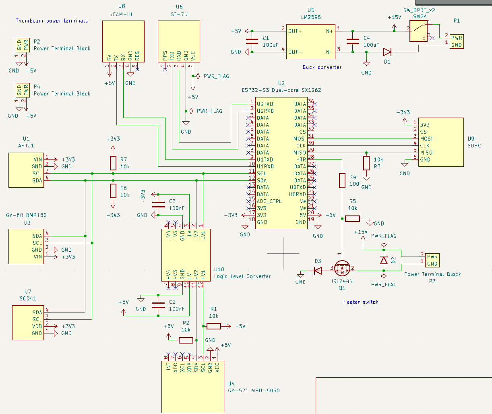

# phat3_code

This Arduino code will run on the
[Heltec ESP32 LoRA V3 915h MHz](https://docs.heltec.org/en/node/esp32/wifi_lora_32/index.html)
([schematic](/documentation/heltec-v3-schematic.pdf)) aboard the
[PHAT-3 mainboard](https://github.com/UWCubeSat/PHAT-3-Main-Board).
It will save data from PCB-mounted sensors to a micro SD card, as well as transmitting it over LoRA.

Sensor purchase requests:
- [Purchase 1](https://docs.google.com/spreadsheets/d/1dPWJqdXrCmhPzfS-cPAt9ABr9ZaCJCoQ50nD71KFVlc/edit?usp=sharing)
- [Purchase 2](https://docs.google.com/spreadsheets/d/1_jEgsWjWWhrQImKw_u3TRmB3PyZUZdtXv6XSBbfWu6M/edit?usp=sharing)

Pinout for connecting to the Heltec board:


Schematic of the PHAT-3 payload:




## Building
To build this project, first configure the VSCode ESP-IDF extension. Then click the "Open ESP-IDF Terminal" widget on the bottom taskbar. Build and flash each project individually:
```bash
cd ./firmware_payload
idf.py build
idf.py flash
cd ..
cd ./firmware_payload
idf.py build
idf.py flash
```

Monitor the output using screen:

```bash
screen /dev/<PORT_PATH> 115200
```


## Libraries

- See [idf_component.yml](/main/idf_component.yml) for dependencies.
- esp-idf-lib libraries used for aht, bmp180, mpu6050, and scd4x.
- igrr/libnmea used for parsing GPS output.
- nopnop2002/sx126x used for controlling built-in radio. Here is [example code](https://github.com/nopnop2002/esp-idf-sx126x/blob/main/basic/main/main.c). (TODO: This will hopefully replace the high-boilerplate driver we used to use in components/sx126x_driver).

## I2C Bus

- SCL - schematic pin 11 - GPIO 41
- SDA - schematic pin 12 - GPIO 42

## Troubleshooting
- Make sure your chip is set to "esp32s3" with `idf.py set-target esp32s3`.
    Confirm it says "esp32s3" in the bottom bar of VSCode.

## Sensors Documentation

### U1: AHT21
Temperature and humidity sensor

- [Purchase link](https://www.amazon.com/HiLetgo-Precision-Temperature-Humidity-2-0-5-5V/dp/B09KGW1G41)
- [AHT 21 Documentation](http://aosong.com/userfiles/files/media/AHT21%20%E8%8B%B1%E6%96%87%E7%89%88%E8%AF%B4%E6%98%8E%E4%B9%A6%20A1%2020201222.pdf)
- On I2C bus
- 7-bit I2C Address: 0x38

### U3: GY-68 BMP180
Temperature and pressure sensor

- [Purchase link](https://www.amazon.com/ACEIRMC-Temperature-Barometric-Pressure-Arduino/dp/B091GWXM8D?th=1)
- [BMP180 Documentation](https://cdn-shop.adafruit.com/datasheets/BST-BMP180-DS000-09.pdf)
- On I2C bus
- 7-bit I2C address: 0x77

### U4: GY-521 MPU-6050
Accelerometer

- [Purchase link](https://www.amazon.com/HiLetgo-MPU-6050-Accelerometer-Gyroscope-Converter/dp/B00LP25V1A?th=1)
- [GY-521 Documentation](https://mysii.gorriens.net/images/arduino/capteurs/gy-521_mpu-6050_3-axis_gyroscope_and_acceleration_sensor_en.pdf)
- On I2C bus
- 7-bit I2C address: 0x68 (because AD0 pin is disconnected)

### U6: GT-U7
GPS

- [Purchase link](https://www.amazon.com/Navigation-Positioning-Microcontroller-Compatible-Sensitivity/dp/B0B31NRSD2)
- [GT-U7 Documentation](https://images-na.ssl-images-amazon.com/images/I/91tuvtrO2jL.pdf)
- [Specification page](https://electropeak.com/goouuu-tech-gt-u7-gps-module?srsltid=AfmBOorSbzLZmO6AaI3c2ZwXSbQamj5tD6vPUmgBJb2MViNQ9iOdiHh1)
- UART GPS
- ESP -> GT-U7 - schematic pin 1 (U2TXD) - GPIO 7
- GT-U7 -> ESP - schematic pin 2 (U2RXD) - GPIO 6

### U7: SCD41
CO2, temperature, humidity

- [Purchase link](https://www.amazon.com/Teyleten-Robot-Dioxide-Temperature-Humidity/dp/B0C622SS34)
- [SCD41 Documentation](https://sensirion.com/media/documents/48C4B7FB/66E05452/CD_DS_SCD4x_Datasheet_D1.pdf)
- On I2C bus
- 7-bit I2C address: 0x62

### U8: UCAM-III
Camera

- [Documentation](https://resources.4dsystems.com.au/datasheets/accessories/uCAM-III/)
- ESP -> UCAM - schematic pin 9 (U1TXD) - GPIO 39
- UCAM -> ESP - schematic pin 10 (U1RXD) - GPIO 40

### U9: SD Card Adapter
- [Purchase link](https://www.amazon.com/UMLIFE-Interface-Conversion-Compatible-Raspberry/dp/B0989SM146?th=1)
- SPI SD Card Reader
- MISO (sub -> main) - schematic pin 29 - GPIO 34
- CLK (clock) - schematic pin 30 - GPIO 33
- MOSI (main -> sub) - schematic pin 31 - GPIO 47
- CS (chip select) - schematic pin 32 - GPIO 48

### Built-in radio: SX1262
- Built-in LoRa radio on the ESP board.
- NSS - GPIO 8
- SCK - GPIO 9
- MOSI - GPIO 10
- MISO - GPIO 11
- RST - GPIO 12
- Busy - GPIO 13
- DIO1 - GPIO 14
